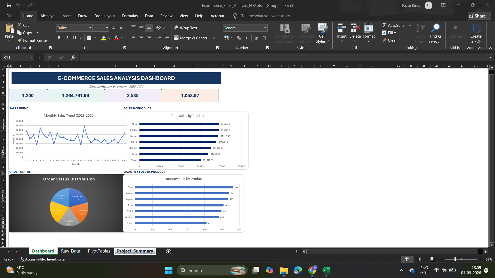

# 📊 E-Commerce Sales Analysis — Exploratory Data Analysis

## 📌 Project Overview

This project focuses on **Exploratory Data Analysis (EDA)** of an e-commerce sales dataset using Microsoft Excel.

The objective is to transform raw sales data into meaningful insights by analyzing sales performance, product performance, order-status distribution, quantity sold, monthly trends, and descriptive statistics.

The project was completed as part of **Project 2 – Exploratory Data Analysis (EDA)** under the DecodeLabs Data Analytics training program.

---

## 🎯 Project Objective

The main objective of this project is to:

- Understand overall e-commerce sales performance
- Analyze monthly and yearly sales trends
- Identify high- and low-performing products
- Analyze order-status distribution
- Analyze quantity sold by product
- Calculate descriptive statistics
- Identify important trends and observations
- Present findings through a professional Excel dashboard
- Generate business-oriented insights and recommendations

---

## 📂 Dataset Overview

The dataset contains e-commerce transaction information including order, customer, product, quantity, pricing, order status, shipping, payment, coupon, referral, and sales-related fields.

### Dataset Summary

| Metric | Value |
|---|---:|
| Total Records | 1,200 |
| Total Columns | 14 |
| Analysis Period | 2023–2025 |
| 2025 Data Coverage | January–June |
| Total Sales | 1,264,761.96 |
| Total Quantity Sold | 3,535 |

> **Note:** 2025 contains data only from January through June. Therefore, 2025 should not be interpreted as a complete-year comparison with 2023 and 2024.

---

## 🛠️ Tools & Techniques

### Tools
- Microsoft Excel

### Techniques
- Data validation
- Data cleaning checks
- Descriptive statistics
- PivotTables
- PivotCharts
- Data visualization
- Trend analysis
- Product-level analysis
- Order-status analysis
- Business insight generation

---

## 📈 Key Performance Indicators

| KPI | Result |
|---|---:|
| Total Orders | 1,200 |
| Total Sales | 1,264,761.96 |
| Total Quantity Sold | 3,535 |
| Average Order Value | 1,053.97 |
| Median Order Value | 823.615 |
| Minimum Order Value | 11.39 |
| Maximum Order Value | 3,456.40 |

---

## 📊 Exploratory Data Analysis

The analysis focused on the following areas:

### 1. Monthly Sales Trend

Monthly sales were analyzed across 2023–2025 to understand fluctuations and identify periods with higher sales activity.

**Highest monthly sales:**

**June 2024 — 68,068.54**

---

### 2. Sales by Product

Product-level sales were analyzed to identify the strongest contributors to total sales.

| Product | Total Sales |
|---|---:|
| Chair | 195,620.11 |
| Printer | 195,612.61 |
| Laptop | 192,126.56 |
| Tablet | 186,568.95 |
| Monitor | 175,651.41 |
| Desk | 167,459.93 |
| Phone | 151,722.39 |

**Key observation:**  
Chair recorded the highest total sales, while Phone recorded the lowest total sales among the products analyzed.

---

### 3. Quantity Sold by Product

| Product | Quantity Sold |
|---|---:|
| Chair | 562 |
| Printer | 542 |
| Laptop | 535 |
| Desk | 508 |
| Tablet | 497 |
| Monitor | 480 |
| Phone | 411 |

**Key observation:**  
Chair recorded the highest quantity sold with **562 units**, while Phone recorded the lowest with **411 units**.

---

### 4. Order Status Distribution

| Order Status | Number of Orders |
|---|---:|
| Cancelled | 250 |
| Returned | 247 |
| Pending | 237 |
| Shipped | 235 |
| Delivered | 231 |
| **Total** | **1,200** |

**Key observation:**  
Cancelled orders represented the largest order-status category with **250 orders**, followed closely by Returned orders with **247 orders**.

---

## 📐 Descriptive Statistics

Descriptive statistics were calculated for the **TotalPrice** variable.

| Statistic | Value |
|---|---:|
| Mean | 1,053.9683 |
| Median | 823.615 |
| Minimum | 11.39 |
| Maximum | 3,456.40 |
| Q1 | 410.52 |
| Q3 | 1,578.475 |
| Interquartile Range | 1,167.955 |
| Range | 3,445.01 |

### Observation

The mean TotalPrice is higher than the median, indicating that some higher-value transactions influence the overall average.

The wide range between the minimum and maximum values also shows substantial variation in transaction values.

---

## 📅 Yearly Sales Analysis

| Year | Total Sales |
|---|---:|
| 2023 | 552,643.24 |
| 2024 | 480,235.87 |
| 2025* | 231,882.85 |

\* 2025 includes January–June only.

Because the 2025 dataset covers only six months, direct full-year comparison with 2023 and 2024 should be avoided.

---

## 🔎 Key Insights

1. **Chair** was the highest-performing product by total sales, generating **195,620.11**.

2. **Chair** also had the highest quantity sold at **562 units**.

3. **Phone** recorded the lowest product sales at **151,722.39** and the lowest quantity sold at **411 units**.

4. **June 2024** recorded the highest monthly sales at **68,068.54**.

5. **Cancelled** was the most frequent order status with **250 orders**.

6. The distribution of order statuses was relatively balanced, with each category contributing a substantial number of orders.

7. Total sales across the complete dataset amounted to **1,264,761.96**.

8. The difference between the mean and median TotalPrice suggests that transaction values are not evenly distributed.

9. The dataset contains considerable variation in order values, ranging from **11.39** to **3,456.40**.

10. Since 2025 contains only January–June records, its sales total requires careful interpretation.

---

## 💡 Business Recommendations

### 1. Focus on High-Performing Products
Maintain sufficient inventory and availability for products such as Chair, Printer, and Laptop that contribute strongly to overall sales.

### 2. Investigate Lower-Performing Products
Analyze customer demand, pricing, promotions, and product characteristics for lower-performing products such as Phone.

### 3. Monitor Cancellations and Returns
Investigate the reasons behind cancelled and returned orders to identify opportunities for improving order fulfillment and customer experience.

### 4. Use Monthly Trends for Planning
Monthly sales patterns can be used to support inventory planning, promotional campaigns, and sales forecasting.

### 5. Consider Partial-Year Data
Future performance comparisons should use comparable time periods, particularly when evaluating 2025 against previous years.

---

## 📊 Dashboard

The project includes a professional Excel dashboard containing:

- **Total Orders KPI**
- **Total Sales KPI**
- **Total Quantity Sold KPI**
- **Average Order Value KPI**
- **Monthly Sales Trend**
- **Yearly Sales**
- **Sales by Product**
- **Order Status Distribution**
- **Quantity Sold by Product**
- **Key Business Insights**

The dashboard provides a consolidated view of the major findings from the exploratory analysis.

### Dashboard Preview



---

## 📁 Repository Structure

```text
ecommerce-sales-analysis-eda/
│
├── Ecommerce_Sales_Analysis_EDA.xlsx
│
├── README.md
│
└── Screenshots/
    └── dashboard.png
